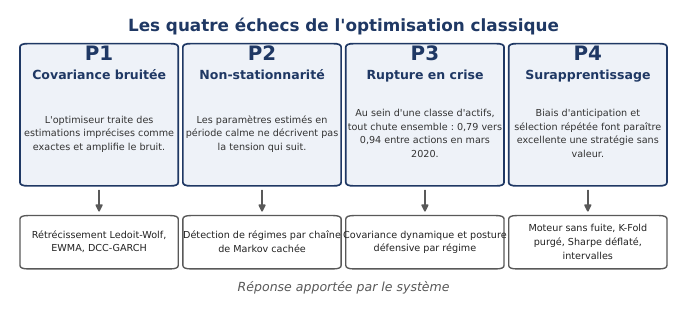
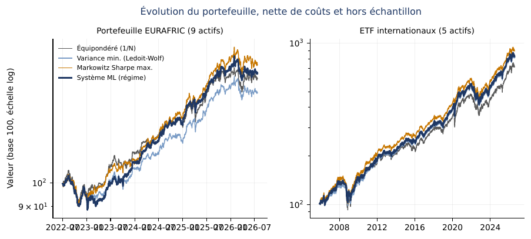
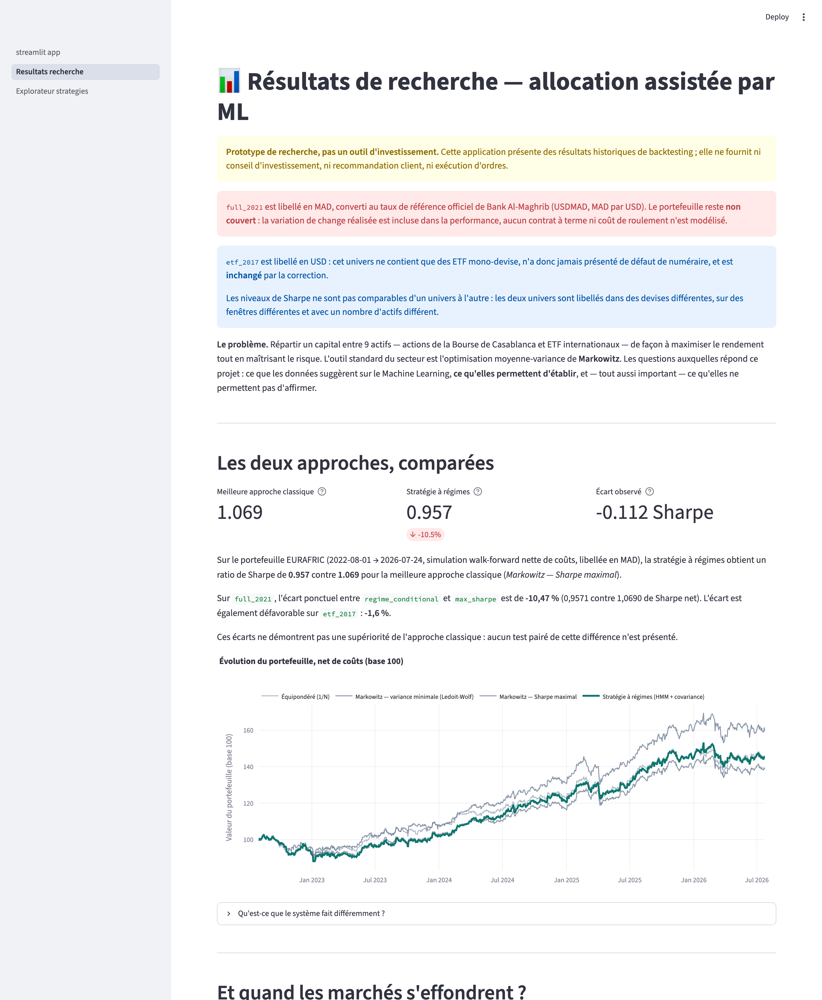

# Portfolio ML — Optimisation de portefeuille robuste et auditable

[](https://github.com/SouhailBourhim/Portfolio_ML/actions/workflows/ci.yml)


**Projet de Fin d’Année — INPT × EURAFRIC Information**<br>
**Équipe :** Souhail Bourhim · Zakarya El Wali · Yasmine Bouajine<br>
**Encadrement :** M. Abdelmouttalib Maqil

> Une chaîne de recherche reproductible pour déterminer si la complexité ML améliore réellement
> une allocation de portefeuille après contraintes, coûts, incertitude statistique et sélection
> de modèles.

[Rapport final — PDF](output/pdf/Rapport_PFA_Final_2026.pdf) ·
[Présentation de soutenance — PowerPoint](output/presentation/Soutenance_PFA_Portfolio_ML_INPT_EURAFRIC.pptx) ·
[Model governance](docs/MODEL_GOVERNANCE.md) ·
[Documentation d’explicabilité](docs/EXPLAINABILITY.md)



## Pourquoi ce projet est différent

Le dépôt ne cherche pas à présenter artificiellement le Machine Learning comme gagnant. Il
construit les contrôles nécessaires pour qu’un résultat puisse être **réfuté** : validation
strictement temporelle, comparaison appariée, correction du data snooping, provenance des
données, observabilité des fallbacks et cohérence automatique entre artefacts, API, dashboard,
model cards et rapport.

La correction la plus importante l’illustre : après conversion des ETF de l’univers mixte au
numéraire MAD avec le taux officiel Bank Al-Maghrib, l’écart observé de la stratégie à régimes
s’est inversé. La release conserve ce résultat négatif au lieu de reconstruire le récit autour
d’un autre benchmark.

### Ce qui est livré

- Pipeline de données **Bronze → Silver → Gold**, validé par contrats et versionné avec DVC.
- Backtest walk-forward long-only, plafond de 25 % par actif et coûts de transaction déduits.
- Baselines classiques : `equal_weight`, minimum variance, Ledoit–Wolf et maximum Sharpe.
- Covariance dynamique : EWMA et DCC-GARCH.
- Régimes de marché : HMM à deux états et allocation conditionnelle.
- Challengers supervisés : Random Forest et XGBoost sur un panel causal par actif.
- Sélection forward-only avec purge, embargo et test final gelé.
- Bootstrap apparié, White Reality Check et Hansen SPA.
- Explicabilité exacte, télémétrie par fit, model cards et politique challenger.
- Dashboard Streamlit, API FastAPI read-only, Docker, CI et portes de release.
- **792 tests** automatisés dans l’état final du dépôt.

## Résultats essentiels

| Question | Résultat actuel | Interprétation autorisée |
|---|---|---|
| Le système à régimes bat-il Markowitz sur `full_2021` ? | Sharpe net **0,9571** contre **1,0690**, écart observé **−10,47 %** | Résultat descriptif défavorable au ML ; aucun test pairé de cette différence n’établit la supériorité inverse. |
| Le système à régimes bat-il la meilleure référence ETF ? | **0,9371** contre **0,9525**, écart observé **−1,62 %** | Le ML ne crée pas de gain observé sur cet univers. |
| Un challenger gagne-t-il après les 240 essais ? | **Non établi** par White RC ou Hansen SPA contre le comparateur primaire pré-spécifié | Le choix du benchmark n’est pas réécrit après observation du résultat. |
| Davantage de données marocaines suffisent-elles ? | L’IC augmente de **×2 à ×4** sur 12 actions, 2005–2024, sans gain portefeuille établi | La limite n’est pas seulement la quantité : qualité, couverture économique et transformation signal → allocation dominent. |
| Quelle intervention est la plus robuste sur les ETF ? | Le plafond de **25 %** : Sharpe 0,9525 contre 0,8650 sans plafond | La contrainte de gestion agit comme un puissant régularisateur de l’erreur d’estimation. |
| Les étiquettes cachent-elles des modèles dégradés ? | **0 fallback sur 1 188 fits**, 4 stratégies et 297 rebalances | Mesure versionnée sur ce snapshot, pas affirmation qu’un fallback est impossible. |



## Données et numéraires

| Univers | Composition | Fenêtre | Numéraire | Usage |
|---|---|---|---|---|
| `full_2021` | 4 actions BVC + 5 ETF | 2021-07-29 → 2026-07 | **MAD**, conversion causale au taux officiel BAM | Univers principal mixte ; exposition USD/MAD non couverte. |
| `etf_2017` | SPY, QQQ, EEM, GLD, TLT | 2004-11 → 2026-07 | **USD** | Historique profond couvrant 2008, 2020 et 2022. |

Les deux univers sont évalués séparément. Leurs niveaux de Sharpe ne sont pas comparables entre
eux : devise, fenêtre et nombre d’actifs diffèrent. L’exposition USD/MAD non couverte de
`full_2021` constitue un **risque économique matériel** ; elle est intégrée aux performances
réalisées, sans contrat de couverture ni coût de roulement.

Les actions BVC utilisent des rendements totaux avec dividendes aux dates de détachement. Les ETF
sont téléchargés ajustés. L’expérience **Maroc profond** ajoute un panel de recherche de 12 actions
sur 2005–2024, mais il n’est pas intégré à la release canonique : réconciliation des sources,
dividendes, corporate actions, raccordement récent et droits de redistribution restent à
industrialiser.

## Architecture

```mermaid
flowchart LR
    S[Sources\nBVC · Yahoo/FRED · BAM] --> B[Bronze\nbrut et persistant]
    B --> V[Silver\ncalendriers · MAD · contrats]
    V --> G[Gold\nrendements · features · preuves]
    G --> BT[Backtest causal\ncontraintes + coûts]
    BT --> M[Modèles\nMarkowitz · HMM · RF/XGB]
    M --> E[Évaluation\nwalk-forward · bootstrap · RC/SPA]
    E --> P[Publication\nAPI · dashboard · rapport]
    P --> GOV[Gouvernance\nmanifest · cards · monitoring]
```



### Modèles évalués

```text
Références classiques
  └─ 1/N · MinVariance · Ledoit-Wolf · MaxSharpe
      └─ Covariance dynamique
          └─ EWMA · DCC-GARCH
              └─ HMM + allocation conditionnelle
                  └─ RF/XGBoost + optimisation sensible aux coûts
```

La complexité est ajoutée par paliers. Un modèle qui ne justifie pas son coût hors échantillon
reste un challenger exploratoire.

## Protocole de validation

1. Features causales : aucune information postérieure à la date de décision.
2. Sélection par walk-forward expanding/rolling, avec purge et embargo.
3. Dernière période gelée pour la comparaison finale.
4. Bootstrap par blocs **apparié** sur les différences de rendements.
5. Correction des 240 configurations atteignables par White Reality Check et Hansen SPA.
6. Publication uniquement depuis des artefacts Gold partageant la même provenance.

Les huit comparaisons appariées publiées contiennent zéro dans leur intervalle. Contre
`regime_conditional`, comparateur primaire pré-spécifié, White RC et Hansen SPA n’établissent
aucune surperformance sur les deux univers et les deux statistiques. Les résultats contre
l’équipondéré restent exploratoires et ne prouvent pas une valeur ajoutée de la couche ML.

## Dashboard et API



- **Résultats de recherche** : faits publiés, devises, résultats, crises et limites.
- **Explorateur de stratégies** : métriques, trajectoires, allocations et export CSV.
- **API FastAPI** : service read-only sur les mêmes artefacts Gold, sans entraînement en requête.
- Les contrats publiés imposent `base_currency` et `hedge_status` ; une devise manquante n’est pas
  silencieusement remplacée par une valeur par défaut.

```bash
# Nécessite le bundle d’artefacts DVC
streamlit run dashboard/streamlit_app.py
uvicorn api.main:app --app-dir src
```

Documentation interactive de l’API : `http://127.0.0.1:8000/docs`.

## Reproduire et vérifier

### Installation locale

```bash
git clone https://github.com/SouhailBourhim/Portfolio_ML.git
cd Portfolio_ML
python3.11 -m venv .venv
source .venv/bin/activate
pip install -r requirements.lock.txt
pytest -q
```

La suite de tests est hors ligne. Les données de marché ne sont pas distribuées dans Git. Le
remote DVC est privé en raison des licences de données ; les membres autorisés configurent leurs
identifiants R2 localement puis exécutent :

```bash
./scripts/dvc.sh pull
./scripts/dvc.sh status
./.venv/bin/python src/snapshot.py verify
```

### Docker

```bash
docker compose run --rm test       # tests hors ligne
docker compose up api              # API, si le bundle DVC est présent
docker compose up notebook         # Jupyter local
```

### Portes de release

```bash
./scripts/release_gates.sh
```

Elles contrôlent l’état DVC, les checksums du snapshot, la complétude du bundle, la régénération
des model cards, la propreté Git et la suite de tests. Le job CI `release-gates` récupère le bundle
depuis R2 avec un token read-only, uniquement sur des événements de confiance.

## Structure du dépôt

```text
src/                 pipeline, backtest, modèles, évaluation, API
dashboard/           application Streamlit à deux vues
data/                artefacts Bronze/Silver/Gold gérés par DVC
experiments/         expériences de robustesse séparées de la release
notebooks/           notebooks exécutés, reconstruits depuis les artefacts finaux
tests/               792 tests unitaires, d’intégration et de gouvernance
docs/                livrables, model cards et rapport source
output/pdf/          rapport final de PFA
output/presentation/ présentation finale de soutenance
dvc.yaml             graphe de production reproductible
params.yaml          paramètres de données, modèles et validation
compose.yaml         API, pipeline, tests et notebooks conteneurisés
```

## Documentation principale

- [Rapport final du PFA](output/pdf/Rapport_PFA_Final_2026.pdf)
- [Présentation de soutenance](output/presentation/Soutenance_PFA_Portfolio_ML_INPT_EURAFRIC.pptx)
- [Model governance](docs/MODEL_GOVERNANCE.md)
- [Model integrity](docs/MODEL_INTEGRITY.md)
- [Explainability](docs/EXPLAINABILITY.md)
- [Data governance](docs/DATA_GOVERNANCE.md)
- [Multiple testing](docs/MULTIPLE_TESTING.md)
- [Deep Morocco experiment](docs/DEEP_MOROCCO_EXPERIMENT.md)
- [ETF deep-history experiment](docs/ETF_DEEP_HISTORY_EXPERIMENT.md)
- [Inference contract](docs/INFERENCE_CONTRACT.md)

## Limites

- L’univers canonique contenant la BVC reste court ; l’expérience profonde améliore le signal mais
  n’est pas encore une source de production réconciliée et contractuelle.
- Un rendement de dividende BVC reste estimé et documenté par analyse de sensibilité.
- La correction multiple porte sur la famille définie de 240 configurations ; les huit
  comparaisons externes constituent un niveau de multiplicité distinct.
- Il n’existe ni exécution d’ordres, ni modèle de capacité/impact marché, ni stratégie de
  couverture USD/MAD.
- Le monitoring est instrumenté **hors ligne** mais volontairement non actif tant que la
  publication atomique, le verrouillage des releases et le rollback ne sont pas exercés.
- La validation reste interne à l’équipe ; une validation indépendante est requise avant tout usage
  institutionnel.

## Positionnement

Ce dépôt est un **prototype de recherche**, pas un outil de conseil, de gestion discrétionnaire ou
d’exécution. Aucune stratégie n’est recommandée. La valeur du projet réside dans la chaîne de
preuve : les données, modèles, décisions, fallbacks et claims publiés sont versionnés et testables.

<!-- BEGIN RELEASE FACTS — generated by scripts/build_release_facts.py -->

### Faits publiés — ce que ce dépôt établit, et ce qu'il n'établit pas

> Bloc généré depuis `src/release_facts.py`. Les mêmes phrases, mot pour mot,
> figurent dans le rapport, le tableau de bord et l'API ; un test échoue si
> une surface s'en écarte.

1. `full_2021` est libellé en MAD, converti au taux de référence officiel de Bank Al-Maghrib (USDMAD, MAD par USD). Le portefeuille reste **non couvert** : la variation de change réalisée est incluse dans la performance, aucun contrat à terme ni coût de roulement n'est modélisé.
2. `etf_2017` est libellé en USD : cet univers ne contient que des ETF mono-devise, n'a donc jamais présenté de défaut de numéraire, et est **inchangé** par la correction.
3. Les niveaux de Sharpe ne sont pas comparables d'un univers à l'autre : les deux univers sont libellés dans des devises différentes, sur des fenêtres différentes et avec un nombre d'actifs différent.
4. Sur `full_2021`, l'écart ponctuel entre `regime_conditional` et `max_sharpe` est de **-10,47 %** (0,9571 contre 1,0690 de Sharpe net). L'écart est également défavorable sur `etf_2017` : **-1,6 %**.
5. Ces écarts ne démontrent pas une supériorité de l'approche classique : aucun test pairé de cette différence n'est présenté.
6. `regime_conditional` demeure le comparateur primaire pré-spécifié des tests White/SPA. Ce choix a été fixé avant l'observation des résultats et n'est pas réécrit maintenant que le signe de l'écart a changé.
7. Correction pour tests multiples (White 2000, Hansen 2005) sur les 240 configurations atteignables : aucun candidat n'établit de surperformance face au comparateur primaire pré-spécifié.
8. Walk-forward imbriqué (fenêtre OOS 2023-07-28 → 2026-07-24, 781 lignes) : le classement est sensible au protocole d'évaluation et à la fenêtre hors échantillon associée. Ratio de Sharpe dégonflé (DSR) = 0,6707 sur 198 configurations.
9. Aucune stratégie n'est recommandée, déployée, ni présentée comme une valeur ajoutée établie. Ce livrable est un prototype de recherche.

<!-- END RELEASE FACTS -->

## Références

- López de Prado, M. (2018). *Advances in Financial Machine Learning*. Wiley.
- DeMiguel, V., Garlappi, L. & Uppal, R. (2009). *Optimal Versus Naive Diversification*.
- Jagannathan, R. & Ma, T. (2003). *Risk Reduction in Large Portfolios: Why Imposing the Wrong Constraints Helps*.
- White, H. (2000). *A Reality Check for Data Snooping*.
- Hansen, P. R. (2005). *A Test for Superior Predictive Ability*.
