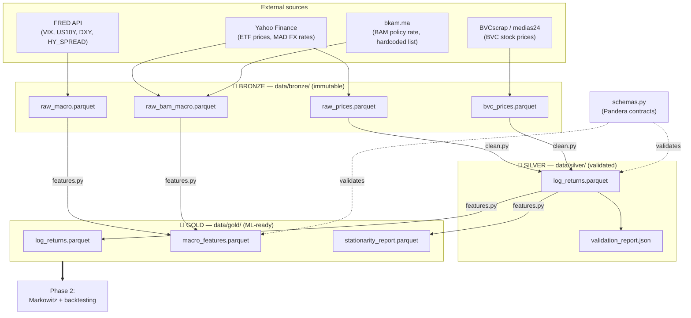

# Phase 1 — Data Infrastructure: Complete Walkthrough

> **Audience:** Zakarya and Yasmine — you can read Python, but you have zero context on this
> codebase, Medallion architectures, or quantitative finance. That's fine; this document assumes
> nothing. Souhail will present it live, section by section, in order.
>
> **What you'll be able to do afterwards:** explain every file in `src/`, defend every design
> decision to Abdelmouttalib, and know exactly where to look when something breaks.

---

## Part 1 — The ideas before the code

### 1.1 Why does a portfolio optimizer need a data pipeline at all?

Our project builds a system that decides how to split money across 9 assets — 4 Moroccan stocks
and 5 international ETFs — using machine learning. Every model we will build in Phases 2–5
(Markowitz, HMM, DCC-GARCH) consumes exactly one thing: **a matrix of daily returns**, where each
row is a date and each column is an asset.

The problem is that this matrix does not exist anywhere. What exists is messy raw material:

- Yahoo Finance gives us ETF prices on **New York trading days**.
- The Casablanca Stock Exchange (BVC) trades on **Moroccan trading days** — different holidays,
  different closures.
- The FRED API (US Federal Reserve data) publishes macro indicators like the VIX with **gaps and
  publication delays**.
- Some Moroccan stocks don't trade every day at all — no trades means no price.

If you feed misaligned, gap-riddled data into a covariance estimator, the output is garbage that
*looks* like a portfolio. Worse: the errors are silent. The optimizer will happily produce weights
from broken inputs. Phase 1 exists to make sure that by the time any model sees the data, it is
aligned, validated, and — most importantly — free of information from the future (more on that in
§1.3, it's the core constraint of the whole project).

**One paragraph version:** Phase 1 turns four incompatible raw data sources into one clean,
validated, ML-ready returns matrix, and proves — with automated checks — that nothing in it could
mislead the models built on top of it.

### 1.2 What is a "Medallion architecture" and why not just "load data, use data"?

Medallion architecture is a data-engineering pattern with three layers, named like Olympic medals:

| Layer | Contents | Rule |
|-------|----------|------|
| 🥉 **Bronze** | Data exactly as the API returned it | Immutable — never edited, only re-downloaded |
| 🥈 **Silver** | Cleaned, aligned, validated data | Every write passes schema validation |
| 🥇 **Gold** | ML-ready features | This is what Phase 2 consumes |

Each layer is a folder of Parquet files under `data/` (`data/bronze/`, `data/silver/`,
`data/gold/`), and each layer is produced *only* from the previous one by a deterministic script.

Why not just download and use? Three reasons, each of which bit real projects:

1. **Debuggability.** When a number looks wrong in the Gold layer, you can diff each layer to find
   *where* it went wrong. With a single "download-and-clean" script, raw and processed data are
   never both on disk, so you can't tell whether the bug is in the source or in your cleaning.
2. **Reproducibility.** Yahoo Finance revises data (corporate actions get re-adjusted). If your
   analysis reads the API directly, re-running it next month gives different numbers and you can't
   explain why. Bronze freezes what we downloaded, when.
3. **Cheap iteration.** Cleaning logic changes constantly during development. Because Bronze is on
   disk, we re-run Silver in seconds instead of re-downloading everything and getting rate-limited
   by Yahoo.

The rule that makes it all work: **Bronze is immutable**. `clean.py` reads Bronze files but never
writes to `data/bronze/`. If the source data changes, we download a new Bronze file — we never
"fix" the old one.

### 1.3 Lookahead bias — the one constraint that rules everything

**Definition:** lookahead bias is when a decision made "as of date t" secretly uses information
that only became available *after* t.

Concrete wrong-vs-right example. Suppose we backtest a strategy that rebalances at the close of
each day:

```
WRONG:  On 2022-06-15, decide today's portfolio weights using
        the VIX value published on 2022-06-15.
        → The VIX close isn't known until the market closes.
          You are trading on a number you couldn't have had.

RIGHT:  On 2022-06-15, decide weights using the VIX from 2022-06-14.
        → Everything you use was printed in yesterday's newspaper.
```

The wrong version will show beautiful backtest performance — the model is effectively
peeking at the answer — and then lose money live. This is problem **P4 (backtest overfitting)**
in our project framing, and it's why published trading strategies so often fail to replicate.

Lookahead bias is insidious because it hides inside innocent-looking code:

- `df.interpolate()` fills a gap using the *next* known value → future information.
- `df.bfill()` (backfill) copies tomorrow's price into today → future information.
- Using same-day macro data as a feature → future information (see the WRONG example above).
- Even *z-scoring with the full-sample mean* leaks the future into the past (we accept this one
  in Phase 1 for EDA purposes; Phase 2's walk-forward framework will re-standardize per window).

Phase 1's answer is structural, not just careful coding: forward-fill only (never backfill, never
interpolate), a mandatory ≥1-day lag on macro features that the code physically refuses to run
without (`test_rejects_zero_lag` locks this in), and tests that verify fills come from the past.

### 1.4 Why financial data breaks generic CSV pipelines

If this were sensor data or web logs, `pd.read_csv().dropna()` would nearly suffice. Financial
data has domain-specific traps:

- **Calendar mismatch.** BVC closes for Eid al-Fitr; NYSE doesn't. NYSE closes for Thanksgiving;
  BVC doesn't. A naive join produces NaN-riddled rows, and a naive "fill with 0" produces fake
  zero-return days that *deflate* volatility and *distort* correlations — directly corrupting P1
  (covariance estimation).
- **Corporate actions.** When a stock splits 2-for-1, its price halves overnight. Without
  adjustment, that looks like a −50% return — a fake crash. Same for dividends. That's why every
  Yahoo Finance call in this repo uses `auto_adjust=True` (non-negotiable decision #3 in CLAUDE.md).
- **Illiquidity.** Some BVC stocks go days without a single trade. The price series goes flat,
  returns are exactly 0, and the estimated correlation with everything else is artificially low.
  We can't fix this — but we detect and flag it (`flag_illiquid_assets`).
- **Non-stationarity.** Price *levels* trend (statistically: they have a "unit root"), which
  violates the assumptions of essentially every model we plan to use. Returns — specifically
  *log*-returns — are approximately stationary. This is why the Silver layer's main output is a
  log-returns matrix, not a price matrix, and why we run formal stationarity tests (ADF + KPSS)
  before declaring the data model-ready.
- **Currency.** BVC prices are in Moroccan dirham (MAD), ETFs in USD. For Phase 1 we work in
  *returns*, which are unitless, so this mostly disappears — but the MAD/USD exchange rate itself
  is a risk factor, which is why we ingest USDMAD and EURMAD as macro features.

Keep these four ideas in mind — pipeline as insurance, Medallion layers, lookahead bias,
finance-specific traps — and every design decision below will feel inevitable rather than
arbitrary.

---

## Part 2 — Architecture walkthrough

### 2.1 The flow



`ingest.py` writes Bronze. `clean.py` transforms Bronze → Silver. `features.py` transforms
Silver → Gold. `schemas.py` is not a stage — it's a **validation layer that cuts across**: the
Silver and Gold writers call it before writing anything to disk. `pipeline.py` runs the whole
chain in order with MLflow tracking, and `src/orchestration/` wraps the same functions as Dagster
assets for scheduled daily runs (out of scope for today).

### 2.2 Bronze — raw storage (`src/ingest.py`)

- **In:** HTTP responses from four sources.
- **Out:** four Parquet files in `data/bronze/`, byte-for-byte what the source said, plus a
  DatetimeIndex.
- **Zero transformation.** No cleaning, no alignment, no filling. The only "processing" is
  structural: naming columns, parsing date strings into a DatetimeIndex.

Why draw the boundary here — why not clean during ingestion, since we're touching the data
anyway? Because **downloads are expensive and flaky** (Yahoo rate-limits us; medias24 scraping
can break), while **cleaning is cheap and changes often**. Separating them means a cleaning bug
never forces a re-download, and a download failure never corrupts previously cleaned data. It
also preserves the evidence: if a BVC price looks insane in Gold, we can open the Bronze file and
see whether medias24 sent us the insane value or we created it.

### 2.3 Silver — cleaned and validated (`src/clean.py`)

- **In:** `raw_prices.parquet` + `bvc_prices.parquet` (Bronze).
- **Out:** `log_returns.parquet` — one validated returns matrix, 9 columns, no NaNs — plus a
  human-readable `validation_report.json`.
- **Steps:** merge BVC into the ETF matrix → align calendars (forward-fill, capped) → compute
  log-returns → flag illiquid assets → Pandera validation → write.

Why is validation *inside* the Silver writer rather than a separate stage? Because a validation
step you can skip is a validation step that *will* be skipped under deadline pressure. In
`silver_pipeline()`, the Parquet write happens on the *validated* return value — there is no code
path that writes unvalidated data to `data/silver/`.

### 2.4 Gold — ML-ready features (`src/features.py`)

- **In:** Silver `log_returns.parquet` + Bronze macro files.
- **Out:** the final `log_returns.parquet` (the Phase 2 input), `macro_features.parquet`
  (lagged, differenced, standardized indicators), `stationarity_report.parquet` (formal proof the
  returns are model-ready).

Why does Gold re-copy log-returns that Silver already produced? So Phase 2 has **exactly one
input directory**. Model code reads `data/gold/` and nothing else — it never needs to know Silver
exists. If we later add Gold-only transformations (e.g., outlier winsorization), Phase 2 code
doesn't change.

Why are macro features Gold but log-returns Silver? Log-returns are a *cleaning* of prices — the
information content is identical. Macro features involve *modeling choices* (which lag, how to
standardize, first-difference or not). Cleaning decisions are stable; feature decisions will be
revisited in Phase 3. The boundary separates what's settled from what's still in play.

---

## Part 3 — File-by-file deep dive

Read this part with the code open. Every claim here is checkable against the repo.

### 3.1 `src/ingest.py` — Bronze layer

#### `_download_single(ticker, start, retries=3)`

**What:** downloads one ticker's price history from Yahoo, retrying up to 3 times with growing
pauses (8s, 16s) before giving up and returning `None`.

**Why it exists:** the naive approach — `yf.download([...9 tickers...])` in one call — worked for
ETFs but silently returned empty data for BVC tickers, which Yahoo serves from a flakier endpoint
and rate-limits aggressively. Downloading one ticker at a time with retry-and-backoff is slower
but *observable*: we get a log line per ticker telling us exactly which one failed.

**Non-obvious detail:** `s.index = pd.to_datetime(s.index).tz_localize(None)` strips timezone
info. Yahoo returns timezone-aware timestamps (`America/New_York`); FRED and BVCscrap return
naive ones. Pandas refuses to align aware with naive indices, so we normalize to naive
immediately at the boundary.

**Problem mapping:** P1, P2 — this is the raw material for covariance estimation and regime
detection. **Tests:** `test_returns_named_series_on_success`,
`test_returns_none_after_exhausting_retries` (which patches `time.sleep` so the test doesn't
actually wait 24 seconds — a trick worth knowing).

#### `_download_batch(tickers, start)`

**What:** loops `_download_single` over a ticker list with a 2-second pause between requests, and
concatenates the survivors into a wide DataFrame.

**Why the pause:** politeness to the API = fewer rate-limit failures = fewer retries = faster
overall. The magic number 2 is empirical, not principled.

#### `ingest_prices(start="2017-01-01")`

**What:** downloads ETFs and BVC equities (as two separate batches), merges in a manual CSV
fallback if `data/bronze/bvc_prices.csv` exists, and writes `raw_prices.parquet`.

**Why `auto_adjust=True` everywhere** (via `_download_single`'s `.history()` call): without it,
stock splits and dividends appear as fake price jumps. A 2-for-1 split becomes a phantom −50%
return that would dominate every covariance and regime estimate downstream. This is
non-negotiable decision #3.

**Why three code paths for BVC prices** (yfinance attempt, BVCscrap, manual CSV): defense in
depth against unreliable sources — yfinance coverage of `.CS` tickers is spotty, BVCscrap depends
on medias24 not changing their site. It's admittedly the most fragile part of the pipeline; see
Limitations §4.1.

**Tests:** `test_writes_bronze_parquet_and_returns_wide_frame`,
`test_raises_when_no_data_downloaded` — the second one locks in "fail loudly, never write an
empty Bronze file."

#### `ingest_macro(start="2017-01-01")`

**What:** downloads 4 FRED series — VIX (fear index), US10Y (10-year Treasury yield), DXY (dollar
index), HY_SPREAD (junk-bond credit spread) — and writes `raw_macro.parquet`.

**Why these four:** each is a candidate *regime signal*. The VIX spikes before equity
correlations do; credit spreads widen when risk appetite dies. They are the external information
that will help the Phase 4 HMM detect a crisis regime early (P2, P3).

**Non-obvious details:** the API key comes from the `FRED_API_KEY` environment variable and the
function raises `EnvironmentError` if it's missing — the key is never in the repo
(non-negotiable #6). Each series downloads inside its own `try/except` that logs-and-continues,
so one failed series doesn't kill the run; only *all four* failing raises. This partial-failure
tolerance is deliberate and pairs with a schema fix described in §3.4.

**Tests:** `test_raises_without_api_key`, `test_writes_bronze_parquet_with_mocked_fred`,
`test_raises_when_all_series_fail`.

#### `ingest_bvc(start="2021-06-24")`

**What:** scrapes BVC closing prices from medias24 via the `BVCscrap` library and writes
`bvc_prices.parquet`.

**Non-obvious code, worth pausing on:**

```python
BVC_NAME_MAP = {
    "Maroc Telecom": "IAM.CS",
    "Attijariwafa":  "ATW.CS",
    "CIH":           "CIH.CS",
    "BCP":           "BCP.CS",
}
BVC_START = "2021-06-24"   # earliest date available from medias24 / BVCscrap

raw.index = pd.to_datetime(raw.index, format="%d/%m/%Y", dayfirst=True)
```

- `BVC_NAME_MAP` translates medias24's French display names into the Yahoo-style tickers used
  everywhere else, so the rest of the pipeline never knows two naming schemes exist.
- `BVC_START` is a hard floor: the free source simply has nothing before 2021-06-24, and the
  function clamps any earlier `start` with `max(start, BVC_START)`. This single constant is the
  root cause of our biggest data limitation (§4.1).
- The date parsing handles medias24's `24/06/2021` day-first format — feed that to pandas without
  `dayfirst=True` and June 4th becomes April 6th silently for any day ≤ 12.

**Tests:** `test_raises_without_bvcscrap_installed` (import-hook trick),
`test_raises_on_empty_scrape`, `test_writes_bronze_parquet_with_mocked_scrape` — the last one
feeds in `"24/06/2021"`-style strings to lock in the day-first parsing.

#### `ingest_bam_macro(start="2017-01-01")`

**What:** builds the Moroccan macro block — USDMAD and EURMAD exchange rates from Yahoo, plus
`TAUX_DIR`, Bank Al-Maghrib's policy interest rate.

**The magic-number list, flagged explicitly:**

```python
_TAUX_DIRECTEUR_DECISIONS = [
    ("2017-01-01", 2.25),  # baseline entry for series start
    ("2020-03-17", 2.00),
    ("2020-06-18", 1.50),
    ...
    ("2026-03-19", 2.25),
]
```

BAM publishes no API. Its policy rate changes only at scheduled committee meetings (~quarterly),
so the entire series is representable as a dozen hand-transcribed (date, rate) pairs from
bkam.ma. The code turns this into a daily **step function**: reindex to business days,
forward-fill from each decision date. That forward-fill is *not* lookahead — the rate genuinely
stays in force until the next decision.

**Why a runtime staleness warning exists:** a hardcoded list rots silently. If nobody adds the
next BAM decision, `TAUX_DIR` keeps extending the old rate forever and no model would notice. So
the function computes days-since-last-entry and logs a warning past 100 days (BAM meets roughly
every 90). As of 2026-06-29, that warning **is firing** — the last entry is 102 days old, which
means: go check bkam.ma. See §4.4.

**Tests:** `test_writes_bronze_parquet_with_mocked_fx`, and `test_taux_directeur_is_step_function`
which pins the exact semantic: dates before the first post-baseline decision must all carry the
baseline rate 2.25, unchanged.

---

### 3.2 `src/clean.py` — Silver layer

#### `merge_bvc_prices(etf_prices)`

**What:** joins `bvc_prices.parquet` onto the ETF price matrix if the file exists; passes ETF
prices through untouched otherwise.

**Why `how="outer"`:** we keep every date either source has, and let the *alignment* step decide
the usable window — merging and windowing are separate concerns. The cost of this choice is that
the pre-2021 ETF rows survive the merge with NaN in the BVC columns, and get dropped later in a
place you might not expect. That interaction was originally silent; it's now loudly warned
(next function) and documented as limitation §4.2.

**Tests:** `TestMergeBvcPrices` in `test_pipeline.py` — passthrough when no file, columns added
when present.

#### `align_calendars(prices, ffill_limit=5)`

The most decision-dense function in the repo. Four choices, each with a reason:

```python
bday_index = pd.bdate_range(prices.index.min(), prices.index.max())
reindexed = prices.reindex(bday_index).ffill(limit=ffill_limit)
...
aligned = reindexed.dropna()
```

1. **Reindex to a full business-day grid.** Casablanca and New York holidays differ; the union
   grid gives every asset the same ruler before we compare them (P1 — misalignment creates fake
   zeros that distort correlation estimates).
2. **Forward-fill, never backfill, never interpolate.** When BVC is closed but NYSE is open, the
   last known BVC price is the best *past-only* estimate. Backfill would copy a future price into
   the past; interpolation would average past and future. Both are lookahead bias. We chose
   forward-fill over the alternatives because it is the only gap-filling method that uses zero
   future information. Locked in by `test_forward_fill_not_backfill`: it blanks a Monday and
   asserts the filled value equals *Friday's* price, not Tuesday's.
3. **`ffill_limit=5` — a magic number.** Uncapped forward-fill would carry a stale price across
   arbitrarily long gaps (a suspended stock would appear frozen-but-alive for months). Five
   business days ≈ one week covers any real holiday cluster; anything longer is a data problem we
   *want* to surface as NaN, not paper over.
4. **`dropna()` at the end — with a tripwire.** Dropping every row where *any* asset lacks data
   guarantees a rectangular, NaN-free matrix. But it has a sharp edge: one late-starting column
   silently deletes the early history of *all* columns. Since BVC starts June 2021 and ETFs start
   2017, this exact edge deleted 4.5 years of ETF history. The function now measures the gap
   between requested and effective start, and warns with names and numbers:

   > `Calendar alignment is dropping 1633 days (2017-01-03 -> 2021-06-24) because
   > ['IAM.CS', 'ATW.CS', 'CIH.CS', 'BCP.CS'] have no data before that point.`

   There's also a fail-fast guard: a column that is *entirely* NaN (a delisted or rate-limited
   ticker) raises `ValueError` immediately, because otherwise `dropna()` would return a 0-row
   DataFrame and the error would surface two stages later with a useless message.

**Tests:** `TestAlignCalendars` (business-days-only, no NaNs, sorted, forward-fill direction,
columns preserved) and `TestLateStartTruncationWarning` in `test_pipeline.py` (warning fires for
a late-starting column, stays silent otherwise).

#### `compute_log_returns(prices)`

**What:** `np.log(prices / prices.shift(1)).dropna()` — one line of math, one dropped row.

**Why log-returns and not `pct_change()`** (non-negotiable #1). We chose log-returns over simple
returns because:

- **Time-additivity:** a 10-day log-return is the *sum* of ten daily log-returns. Simple returns
  compound multiplicatively, which breaks the linear algebra that portfolio math and our models
  assume. Locked in by `test_log_returns_sum_to_total_return`, which asserts
  `sum(daily) == log(P_end/P_start)` to 6 decimal places — a property simple returns provably
  don't have.
- **Stationarity:** price levels have unit roots (P2); log-returns are approximately stationary,
  which HMM and DCC-GARCH require.
- **Distribution:** closer to Gaussian at daily horizon, friendlier to everything downstream.

Any future code that computes `pct_change()` on prices for modeling purposes is a bug by
definition.

#### `flag_illiquid_assets(log_returns, max_consecutive_zeros=5)`

**What:** warns when any asset has ≥5 *consecutive* zero-return days.

**Why consecutive runs and not a total count** — this is the subtle part:

```python
def max_run(s: pd.Series) -> int:
    is_zero = (s.abs() < 1e-10).astype(int)
    groups = (is_zero != is_zero.shift()).cumsum()
    return int(is_zero.groupby(groups).sum().max())
```

A *single* zero-return day is normal and correct: it's what forward-filling a holiday produces.
Counting total zeros would flag every asset with many holidays. A *run* of 5+ consecutive zeros
is different — that's a trading halt or genuine illiquidity, which makes the asset's covariance
estimates unreliable (P1). The groupby-cumsum idiom finds the longest run: `cumsum` over
"did the zero-flag change?" assigns a group ID to each unbroken stretch, then we take the largest
zero-stretch. The `1e-10` tolerance exists because floating-point log-returns are almost never
exactly `0.0`.

On real data this currently flags CIH.CS and BCP.CS (5-day runs each) — a warning, not an error,
because BVC illiquidity is a fact we live with, not a pipeline bug.

**Tests:** `test_warns_on_consecutive_zeros` (injects a fake 10-day halt),
`test_no_warn_for_single_holiday_zeros` (scattered single zeros must NOT warn — this test runs
with `warnings.simplefilter("error")` so any warning fails it), `test_no_warn_for_normal_data`.

#### `silver_pipeline(ffill_limit=5)` and `_write_validation_report(...)`

**What:** orchestrates the Silver stage — load Bronze → merge BVC → align → log-returns →
illiquidity flag → **Pandera validate** → write Parquet → write JSON report.

The JSON report (`data/silver/validation_report.json`) is the artifact you show a human: row
counts, date range, per-asset annualized stats, and two fields added specifically so the
truncation problem can't hide: `requested_start_date: 2017-01-01` and
`history_truncated_by_days: 1636`. If those numbers ever surprise you, the pipeline told you
before your supervisor did.

**Tests:** `TestSilverPipelineIntegration` in `test_pipeline.py` runs this whole function
end-to-end against synthetic Bronze files on disk — the only test that would catch a broken file
path, a renamed function, or a missing directory (see §4.3 for why that matters).

---

### 3.3 `src/features.py` — Gold layer

#### `run_stationarity_tests(log_returns)`

**What:** runs *two* statistical tests — ADF and KPSS — on every return series and classifies
each as STATIONARY / NON-STATIONARY / AMBIGUOUS.

**Why two tests instead of one** (non-negotiable #2). The tests have *opposite* null hypotheses:

- **ADF** assumes non-stationarity and looks for evidence *against* it.
- **KPSS** assumes stationarity and looks for evidence *against* it.

A single test can't distinguish "the data is stationary" from "the test lacked power to detect
the problem." Two opposite tests can:

| ADF says | KPSS says | Verdict |
|----------|-----------|---------|
| rejects unit root (p < .05) | doesn't reject stationarity (p > .05) | **STATIONARY** — both agree |
| doesn't reject (p > .05) | rejects stationarity (p < .05) | **NON-STATIONARY** — both agree |
| anything else | | **AMBIGUOUS** — investigate by hand, never assume |

We chose the dual test over ADF-alone because ADF-alone produces false confidence exactly when
the data is trickiest. On our real data, 8 of 9 assets come out STATIONARY; EEM is AMBIGUOUS
(plausibly a structural break from the 2022 emerging-markets sell-off) — flagged in the EDA
notebook, treated as stationary with a documented caveat.

**Why this matters at all:** HMM and DCC-GARCH (Phase 4) assume their input is stationary (P2).
This report is the *proof* the assumption holds, written to
`data/gold/stationarity_report.parquet` so the claim is versioned data, not a verbal assurance.

**Non-obvious detail:** the KPSS call is wrapped in `warnings.catch_warnings()` because
statsmodels emits an InterpolationWarning when the p-value falls outside its lookup table —
noisy but harmless.

**Tests:** `TestStationarity` — most notably `test_gbm_returns_are_stationary`: the synthetic
fixture generates returns that are stationary *by construction*, so if the function doesn't say
STATIONARY for all of them, the function is wrong, not the data.

#### `build_macro_features(raw_macro, returns_index, lag_days=1)`

**What:** turns raw macro levels into ML features via exactly four transformations, in order:

```python
if lag_days < 1:
    raise ValueError("lag_days must be >= 1 to prevent lookahead bias.")

macro        = raw_macro.reindex(returns_index, method="ffill")   # 1. align
macro_diff   = macro.diff().dropna(how="all")                     # 2. difference
macro_scaled = (macro_diff - macro_diff.mean()) / macro_diff.std()# 3. z-score
macro_lagged = macro_scaled.shift(lag_days).dropna(how="all")     # 4. LAG
```

1. **Align via forward-fill:** FRED has gaps and publishes on its own calendar; past-only fill,
   same reasoning as `align_calendars`.
2. **First-difference:** macro *levels* (VIX at 20, US10Y at 4%) have unit roots; day-over-day
   *changes* are stationary. Same logic as prices → returns.
3. **Z-score:** puts VIX changes (±3 points) and rate changes (±0.05) on one scale so no feature
   dominates by units. (Full-sample z-scoring has the mild leak noted in §1.3; Phase 2's
   walk-forward framework will re-fit it per training window.)
4. **Lag by ≥1 day — the load-bearing line.** Features dated t contain only information printed
   by t−1. And note the guard *above* the transformations: `lag_days=0` doesn't produce worse
   features, it **raises**. We chose a hard error over a default-you-can-override because
   lookahead bias is the one mistake this project cannot survive (P4). Locked in by
   `test_rejects_zero_lag` — the test literally asserts the error message contains "lookahead" —
   and `test_lag_prevents_same_day_data`.

**Non-obvious detail:** `dropna(how="all")` instead of plain `dropna()`. HY_SPREAD sometimes has
gaps; a plain `dropna()` would delete every row where *any* series is missing, letting the
sparsest FRED series dictate the whole feature matrix's coverage. `how="all"` keeps partial rows
and lets NaN-tolerance be decided per-model later (the macro schema permits NaN — see §3.4).

**Problem mapping:** P2, P3 — these features are how the Phase 4 HMM will see a regime change
(VIX spike, spread blowout) *before* it shows up in return correlations.

#### `gold_pipeline(lag_days=1)`

**What:** loads Silver log-returns (failing with a pointed message if Silver hasn't run), runs
stationarity tests, copies log-returns to Gold, concatenates FRED + BAM macro blocks, builds
features, **validates against `MACRO_FEATURES_SCHEMA`**, writes three Gold artifacts.

**Design choice:** FRED and BAM blocks are each optional — a missing Bronze file logs a warning
and the pipeline continues with whatever exists. Degrade gracefully, but loudly. Only *zero*
macro data skips the feature step entirely.

---

### 3.4 `src/schemas.py` — the validation layer

Pandera schemas are **data contracts**: executable specifications of what a DataFrame must look
like, enforced at runtime. Where a type-checker validates code, Pandera validates data. Each
schema check maps to a concrete downstream failure it prevents:

| Check | Failure it prevents |
|-------|---------------------|
| every return in ±50% | an unadjusted split (fake −50% day) reaching the covariance matrix (P1) |
| ≥ 500 rows | covariance estimated from too little history — mathematically valid, statistically meaningless (P1) |
| index sorted ascending | walk-forward backtests silently training on shuffled time (P4) |
| zero NaNs in returns | models mishandling missing data in undefined ways |
| index is DateTime named "Date" | subtle join bugs from string-typed dates |

**`validate_log_returns(df)`** builds its schema dynamically from whichever expected columns are
present: hard `ValueError` if no ETFs at all, but only a *warning* if BVC tickers are missing
(with instructions for the manual-CSV fallback). Why warn instead of fail? Because BVC data comes
from the fragile scraping path, and an ETF-only pipeline run is still useful for development —
degraded, not broken.

**`LOG_RETURNS_SCHEMA`** is the static all-9-columns variant used by tests; unlike the dynamic
one it *does* fail on a missing column (`test_all_expected_columns_required`).

**`MACRO_FEATURES_SCHEMA`** is deliberately laxer: NaN allowed (macro gaps are legitimate),
`strict=False` (extra columns like the BAM series are fine), and — the subtle one —
`required=False` on every FRED column:

```python
columns={
    series: Column(dtype=float, nullable=True, required=False)
    for series in ["VIX", "US10Y", "DXY", "HY_SPREAD"]
},
```

This line is a fresh bug fix (2026-06-29) with a lesson in it: `strict=False` permits *extra*
columns but still requires every *declared* column to exist. When one FRED series (US10Y) failed
to download, `ingest_macro` tolerated it by design — but the schema then crashed the entire Gold
stage in Dagster over the missing column. The two layers disagreed about whether a missing series
was acceptable. `required=False` makes the schema match the ingestion philosophy: validate
whatever arrived, don't fail the world over one series.

**Tests:** `TestLogReturnsSchema` is essentially the P1/P4 protection expressed as executable
examples — `test_rejects_extreme_returns` (a 99% daily return must be refused),
`test_rejects_too_few_rows`, `test_rejects_unsorted_index`, `test_rejects_nans`.
`test_allows_nans_in_macro` pins the deliberate asymmetry between the two schemas.

---

### 3.5 `src/pipeline.py` — the entry point

**What:** `run_phase1()` executes Bronze → Silver → Gold in order, inside one MLflow run.

```python
with mlflow.start_run(run_name="phase1_full"):
    raw_prices  = ingest_prices()      # Bronze
    ...
    log_returns = silver_pipeline()    # Silver (validates internally)
    gold        = gold_pipeline()      # Gold   (validates internally)
    mlflow.log_metrics({ "n_stationary_assets": ..., ... })
    mlflow.log_artifacts(".../data/gold", artifact_path="gold_layer")
```

**Why MLflow for a data pipeline?** Every run logs its parameters (ticker counts, date ranges)
and outcome metrics (trading days, stationary-asset count) and archives the entire Gold layer as
run artifacts. When Phase 2 results look odd three weeks from now, we can answer "which exact
dataset was that trained on?" by opening the MLflow run — reproducibility as a habit, started
before the models exist. (Dagster, which schedules the same functions daily, tracks *execution*:
did the run succeed, when. MLflow tracks *results*. Different questions, both kept.)

**Other details:** `load_dotenv(...)` at the top loads `FRED_API_KEY` from the git-ignored
`.env`; the `__main__` block wraps everything in try/except that logs the full traceback and
exits 1, so a scheduled run fails with a proper exit code instead of dying silently.

**Tests:** no direct unit test — it's thin glue over tested functions — but
`TestSilverPipelineIntegration` covers the riskiest segment end-to-end (see §4.3).

---

## Part 4 — Known limitations (be honest)

Presented in the same spirit we'll present to Abdelmouttalib: each with its impact, severity, and
whether it blocks Phase 2.

### 4.1 BVC data starts June 2021 — the dataset lost the COVID crash

**Fact:** BVCscrap/medias24 (free tier) has no BVC prices before 2021-06-24. Pre-2021 data needs
a paid vendor or manual downloads from casablanca-bourse.com.

**Impact:** the merged matrix runs 2021-06-25 → today (1306 rows), not 2017 → today (~2400) as
planned. The 2020 COVID crash — the single best natural experiment for P3, diversification
breakdown — is **not in our dataset**. Our P3 evidence rests on the 2022 rate shock alone, one
crisis instead of two. Phase 2's walk-forward backtest also has ~5 years of window instead of ~9:
enough, but thinner than designed.

**Severity: Medium-High** (weakens P3 evidence; reduces backtest depth).
**Blocks Phase 2? No** — 1306 rows is 2.6× the schema's 500-row floor. **Must be disclosed**,
never implied away: the EDA notebook summary and the validation report both state it explicitly.
Resolution (paid vendor) is a scope decision for the team + supervisor, deferrable.

### 4.2 Outer-join + `dropna()` truncation was a silent failure mode

**Fact:** `merge_bvc_prices` keeps all dates (`how="outer"`); `align_calendars` ends in
`dropna()`. Composed, they mean *any* late-starting column silently deletes all columns' early
history. This is exactly how 4.5 years of ETF data vanished with no error and no log line —
the classic silent failure: output looks perfectly healthy, and the first hint would have been
Abdelmouttalib asking "why does your 2017 dataset start in 2021?"

**Mitigation now in place (2026-06-29):** `align_calendars` warns with the responsible columns
and the day count; `validation_report.json` carries `requested_start_date` and
`history_truncated_by_days: 1636`; `TestLateStartTruncationWarning` locks the warning in.

**Severity: was High, now Low** (loud, tested, reported — though still a warning, not a hard
error; a fresh teammate could conceivably ignore it, which is partly why this document exists).
**Blocks Phase 2? No.**

### 4.3 Integration testing arrived late

**Fact:** until 2026-06-29 every test exercised one function in isolation with synthetic
in-memory data. Correct practice, but with a blind spot: nothing verified the functions *compose*
— that file paths line up, that Silver writes where Gold reads, that a renamed argument doesn't
break the chain. That whole class of bug would surface only at runtime, potentially in a 22:00
scheduled Dagster run with nobody watching.

**Mitigation now in place:** `tests/test_pipeline.py::TestSilverPipelineIntegration` runs
`silver_pipeline()` end-to-end against synthetic Bronze Parquet files on a temp disk, asserting
both output files exist and the result passes validation.

**Severity: Low** (residual gaps: the Gold stage and the Dagster asset wiring still lack
equivalent end-to-end tests). **Blocks Phase 2? No** — worth extending when Phase 2 adds moving
parts.

### 4.4 The BAM policy-rate list is hand-maintained — and stale right now

**Fact:** `_TAUX_DIRECTEUR_DECISIONS` is hardcoded because BAM has no API. Failure mode: nobody
adds the next rate decision, and `TAUX_DIR` silently forward-fills an outdated rate forever —
plausible-looking, wrong, invisible to every schema check.

**Mitigation now in place:** a maintenance comment explains the update procedure, and
`ingest_bam_macro` warns when the last entry exceeds 100 days old. **That warning is live as of
2026-06-29** (last entry 2026-03-19, 102 days ago) — BAM's June 2026 meeting has presumably
happened. **Concrete action item: check bkam.ma and append the June 2026 decision.**

**Severity: Low-Medium** (one feature among seven, currently at most one quarter stale).
**Blocks Phase 2? No** — but do the 5-minute update before the Phase 2 kickoff.

### 4.5 Honorable mention: EEM is stationarity-AMBIGUOUS

ADF and KPSS disagree on EEM (likely a 2022 EM-sell-off structural break). Treated as stationary
with a documented flag in the EDA notebook. Severity: Low; revisit if EEM behaves oddly in
Phase 4 regime models.

---

## Part 5 — Glossary

Plain-language definitions of every technical term used above, so this document is self-contained.

- **ADF (Augmented Dickey-Fuller) test** — a statistical test whose *default assumption* is that a
  series is non-stationary; a low p-value (< 0.05) is evidence the series is actually stationary.
- **Backfill** — filling a missing value by copying the *next* known value backwards in time.
  Banned in this repo: it moves future information into the past.
- **Backtest** — simulating how a trading strategy *would have* performed on historical data.
- **Bronze / Silver / Gold** — see *Medallion architecture*.
- **Business day** — a weekday. `pd.bdate_range` generates Monday–Friday grids (it ignores
  holidays, which is exactly why we still need forward-fill on top of it).
- **Covariance matrix** — the table of how every asset co-moves with every other; the core input
  of portfolio optimization and the subject of P1 (it's very noisy when estimated from data).
- **DCC-GARCH** — the Phase 4 model producing a covariance matrix that *changes over time*
  instead of assuming one constant matrix.
- **ETF (Exchange-Traded Fund)** — a fund that trades like a stock; ours track baskets (S&P 500,
  gold, US Treasuries…), giving cheap diversified exposure.
- **First difference** — today's value minus yesterday's. Turns a trending series (levels) into a
  usually-stationary one (changes).
- **Forward-fill (ffill)** — filling a gap by carrying the *last known* value forward. Allowed:
  uses only past information.
- **FRED** — Federal Reserve Economic Data, a free API for macroeconomic series.
- **HMM (Hidden Markov Model)** — the Phase 4 model that infers which unobserved market "regime"
  (calm / stressed / crisis) each day belongs to.
- **Illiquidity** — an asset that rarely trades. Its flat price stretches produce zero returns
  that corrupt correlation estimates.
- **KPSS test** — the mirror image of ADF: its default assumption is that the series *is*
  stationary; a low p-value is evidence it isn't. Used together with ADF because they fail in
  opposite directions.
- **Lag** — shifting a series so that the value dated *t* is actually the observation from *t−1*
  (or earlier). Our anti-lookahead mechanism for features.
- **Log-return** — `ln(P_today / P_yesterday)`. Our unit of return, chosen for time-additivity
  and stationarity (§3.2).
- **Lookahead bias** — using information at decision time that only became available later. The
  cardinal sin of backtesting; see §1.3.
- **Medallion architecture** — three-layer data organization: Bronze (raw, immutable), Silver
  (clean, validated), Gold (ML-ready). See §1.2.
- **Parquet** — a compressed, typed, columnar file format; 10–100× faster than CSV for our access
  patterns, and it preserves dtypes (CSV would turn our dates back into strings).
- **Pandera** — a library for declaring and enforcing *data contracts* on DataFrames at runtime.
- **Regime** — a persistent market state (e.g., low-volatility bull vs. high-correlation crisis)
  with its own statistical behavior.
- **Schema validation** — automatically checking data against a declared contract (types, ranges,
  row counts) before accepting it.
- **Stationarity** — the property that a series' statistical behavior (mean, variance) doesn't
  drift over time. Prices aren't; log-returns approximately are. Required by our Phase 4 models.
- **Step function** — a series that stays constant and jumps at discrete moments — the natural
  shape of a policy interest rate.
- **Unit root** — the technical property that makes a series non-stationary (shocks never decay;
  the series wanders). What ADF tests for.
- **VIX** — an index of expected S&P 500 volatility, the market's "fear gauge"; spikes in crises,
  which makes it a prime regime signal.
- **Walk-forward backtesting** — Phase 2's evaluation scheme: repeatedly train only on data before
  date t, test after t, roll forward. Simulates live operation without lookahead.
- **Z-score / standardize** — rescale a series to mean 0, standard deviation 1, so differently
  sized features are comparable.

---

## Part 6 — Traceability: how Phase 1 maps to P1–P4

The view Abdelmouttalib expects — every problem, and exactly which code addresses it.

| Problem | What goes wrong in classical MPT | Phase 1 functions that address it | How |
|---------|----------------------------------|-----------------------------------|-----|
| **P1 — Noisy covariance estimation** | Sample covariance amplifies estimation error → unstable, concentrated portfolios | `align_calendars` (clean.py) · `flag_illiquid_assets` (clean.py) · `validate_log_returns` / `LOG_RETURNS_SCHEMA` (schemas.py) · `ingest_prices` (ingest.py) | Removes fake zeros from calendar misalignment; flags illiquid assets whose correlations are unreliable; enforces ±50% return bounds and a 500-row minimum so covariance inputs are clean and sufficient; `auto_adjust=True` prevents split/dividend artifacts |
| **P2 — Non-stationarity** | Parameters estimated in one period are invalid in the next | `compute_log_returns` (clean.py) · `run_stationarity_tests` (features.py) · `build_macro_features` steps 1–3 (features.py) · `ingest_macro` / `ingest_bam_macro` (ingest.py) | Log-transform makes returns stationary; dual ADF+KPSS *proves* it per asset and writes the proof to Gold; macro levels are first-differenced and standardized; VIX/spreads/BAM rate feed future regime detection |
| **P3 — Diversification breakdown in crises** | Correlations spike exactly when diversification is needed | `ingest_bvc` (ingest.py) · `ingest_bam_macro` (ingest.py) · `build_macro_features` (features.py) · `merge_bvc_prices` (clean.py) | Supplies the BVC + international cross-market universe whose crisis correlations we study; macro features (VIX, HY_SPREAD, USDMAD, TAUX_DIR) are the early-warning signals for regime shifts; EDA (notebook §7–8) documents the 2022 correlation spike empirically |
| **P4 — Backtest overfitting / lookahead** | Future data leaks into past decisions → inflated Sharpe ratios that fail live | `build_macro_features` lag guard (features.py) · forward-fill-only policy in `align_calendars` (clean.py) · index-sorted check in schemas.py · Bronze immutability (ingest.py) | `lag_days ≥ 1` enforced by a raised exception (`test_rejects_zero_lag`); no backfill/interpolation anywhere (`test_forward_fill_not_backfill`); monotonic-index validation protects walk-forward integrity; immutable Bronze makes every experiment reproducible |

Note the asymmetry, and say it out loud in the presentation: **P1–P3 are *addressed* by giving
future models clean inputs and the right signals; P4 is the only problem Phase 1 can fully
*enforce* today** — and it does, structurally: the code raises rather than permitting a
zero-lag feature, and the fill policy makes lookahead impossible rather than merely discouraged.

---

## Part 7 — If something breaks, start here

1. **Run the test suite first: `python -m pytest tests/ -q` (47 tests, ~3 s).**
   The tests are synthetic and offline — no network, no API keys. So the split is diagnostic:
   *tests fail* → the logic is broken (look at the failing test's name; each encodes the rule it
   locks in, e.g. `test_forward_fill_not_backfill`, `test_rejects_zero_lag`). *Tests pass but the
   pipeline fails* → the problem is external: network, API keys, or the data itself.
2. **Read the logs — the pipeline is designed to narrate its own problems.** Every stage logs at
   INFO; every known failure mode warns loudly: the 1633-day truncation warning, the illiquidity
   flags, the BAM staleness warning. A silent run that produced weird data is a bug worth
   reporting in itself.
3. **Open `data/silver/validation_report.json`.** Row counts, date range, truncation fields,
   per-asset stats — most "the data looks wrong" questions are answered there in 30 seconds.
4. **Walk the layers backwards.** Weird number in Gold? Check it in Silver
   (`data/silver/log_returns.parquet`). Weird in Silver? Check Bronze. Weird in Bronze? The
   *source* sent it — that's an ingestion/vendor problem, not a cleaning bug. This backwards walk
   is the entire payoff of the Medallion architecture.
5. **Common specifics:** `EnvironmentError: FRED_API_KEY` → missing `.env` file at repo root.
   Pandera `SchemaError` → the message names the exact violated check; the fix is upstream of the
   validation, never "loosen the schema so it passes." Yahoo returning nothing for a `.CS`
   ticker → wait and retry (rate limits) or use the manual-CSV fallback described in the
   `validate_log_returns` warning message.

---

*Written 2026-06-29, matching the code as of commit `9b37b08`. If the code has moved since, trust
the code and the tests over this document — then update the document.*
